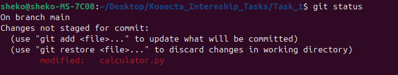
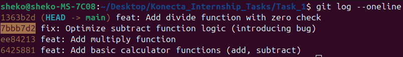
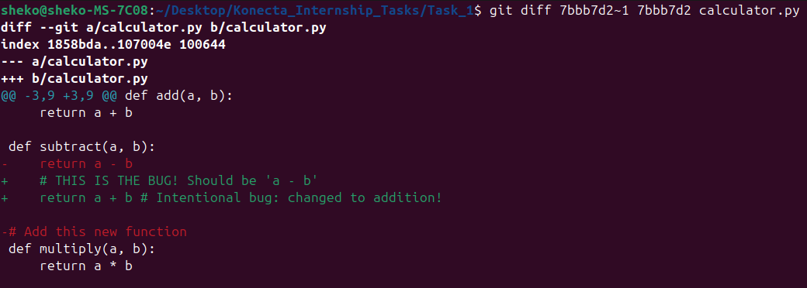
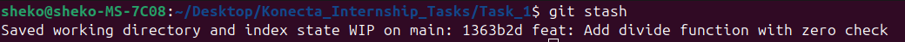
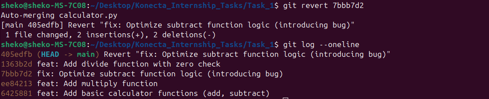
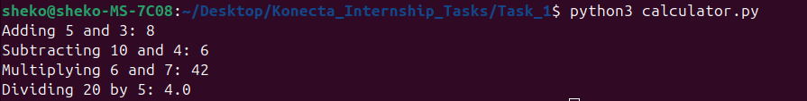
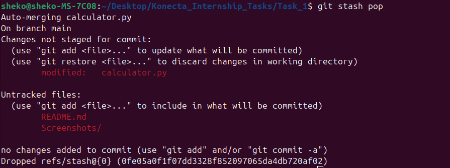
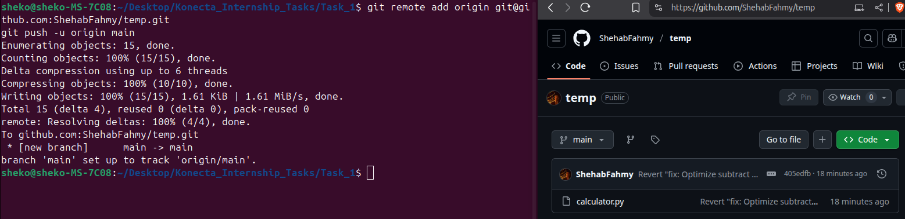

# Online Activity (Task-Based): Debugging & Restoring Changes
This activity will deepen your understanding of Git's powerful history management capabilities, allowing you to debug issues and restore previous versions of your code. This is a crucial skill for any developer!

**Learning Objective**: Students will be able to use `git log`, `git diff`, `git stash`, and `git reset` (or `git revert`) to identify erroneous commits, temporarily save work, and restore previous versions of code.
**Estimated Time**: 1-2 hours

---

## 7.1 Scenario: The Accidental Bug and Unfinished Work
Imagine you're developing a simple Python script. You've been making a series of commits, adding features and making improvements. However, a few commits ago, you accidentally introduced a critical bug (e.g., a syntax error or logic flaw that breaks a core function). To make matters worse, you've already made several more good commits on top of the buggy one, and you also have some unfinished, unsaved work in your current files.
You need to:
    1. Figure out exactly when the bug was introduced.
    2. Temporarily save your current, unsaved work.
    3. Fix the bug by undoing the problematic commit (or its changes).
    4. Restore your unsaved work.

---

## 7.2 Simulation Steps (Set up your local repository for the task):
1. Start Clean:
    - Go to your `my-first-git-project` from the hands-on lab, or create a new empty directory and `git init` it.
    - Make sure you are on the `main` branch: `git checkout main`.
    - Create a simple Python file named `calculator.py`:
        ```python
        # calculator.py
        def add(a, b):
            return a + b

        def subtract(a, b):
            return a - b

        print(f"Adding 5 and 3: {add(5, 3)}")
        print(f"Subtracting 10 and 4: {subtract(10, 4)}")
        ```
    - Initial commit:
        ```bash
        git add calculator.py
        git commit -m "feat: Add basic calculator functions (add, subtract)"
        ```
2. Add multiply function (Good Commit 1):
    - Modify `calculator.py`:
        ```python
        # calculator.py
        def add(a, b):
            return a + b

        def subtract(a, b):
            return a - b

        # Add this new function
        def multiply(a, b):
            return a * b

        print(f"Adding 5 and 3: {add(5, 3)}")
        print(f"Subtracting 10 and 4: {subtract(10, 4)}")
        print(f"Multiplying 6 and 7: {multiply(6, 7)}")
        ```
    - Commit:
        ```bash
        git add calculator.py
        git commit -m "feat: Add multiply function"
        ```
3. Introduce the Bug (Erroneous Commit):
    - Modify `calculator.py` again. Intentionally introduce a bug in the subtract function.
        ```python
        # calculator.py
        def add(a, b):
            return a + b

        def subtract(a, b):
            # THIS IS THE BUG! Should be 'a - b'
            return a + b # Intentional bug: changed to addition!

        def multiply(a, b):
            return a * b

        print(f"Adding 5 and 3: {add(5, 3)}")
        print(f"Subtracting 10 and 4: {subtract(10, 4)}")
        print(f"Multiplying 6 and 7: {multiply(6, 7)}")
        ```
    - Commit the bug:
        ```bash
        git add calculator.py
        git commit -m "fix: Optimize subtract function logic (introducing bug)"
        ```
        ***Note***: A real commit message would not say "introducing bug"!
    - Test the bug: Run `python calculator.py`. Notice that "Subtracting 10 and 4" outputs "14" instead of "6".
4. Add divide function (Good Commit 2 - After the bug):
    - Modify `calculator.py` again:
        ```python
        # calculator.py
        def add(a, b):
            return a + b

        def subtract(a, b):
            # THIS IS THE BUG! Should be 'a - b'
            return a + b # Intentional bug: changed to addition!

        def multiply(a, b):
            return a * b

        # Add this new function
        def divide(a, b):
            if b == 0:
                return "Cannot divide by zero!"
            return a / b

        print(f"Adding 5 and 3: {add(5, 3)}")
        print(f"Subtracting 10 and 4: {subtract(10, 4)}")
        print(f"Multiplying 6 and 7: {multiply(6, 7)}")
        print(f"Dividing 20 by 5: {divide(20, 5)}")
        ```
    - Commit:
        ```bash
        git add calculator.py
        git commit -m "feat: Add divide function with zero check"
        ```
5. Make Uncommitted Changes (Work in Progress):
    - Modify `calculator.py` one more time, but DO NOT COMMIT OR ADD IT.
        ```python
        # calculator.py (at the very end of the file)
        # Some new experimental print statement
        print("Experimental feature: Fibonacci sequence next")
        ```
    - Check status: `git status` (You should see `calculator.py` as "modified").

<p align="center">
  
</p>

---

## 7.3 Your Task: Debugging and Restoration
Follow these steps using Git commands:
1. Identify the Erroneous Commit:
    - Use `git log --oneline` to view your commit history.
    - From the output, visually identify the short commit hash of the commit titled "fix: Optimize subtract function logic (introducing bug)".
    - Copy this commit hash.
    
<p align="center">
  
</p>
    
    - Use `git diff [commit-hash-of-bug]~1 [commit-hash-of-bug] calculator.py` to specifically see what changes were introduced by that particular commit in `calculator.py`. Replace `[commit-hash-of-bug]` with the actual hash you copied.
        - **Explain in your deliverables**: What does this `git diff` command show you? How did it help you confirm the bug?
        
<p align="center">
  <strong>Difference in lines between the bug commit and the commit before it for the `calculator.py` file, showing the correct line was deleted and a false one was added instead.</strong>
  <br>
  
</p>

2. Temporarily Save Your Uncommitted Work:
    - Use `git stash` to save your current uncommitted changes to a temporary storage.
        - **Explain in your deliverables**: Why is `git stash` useful in this scenario?
        
<p align="center">
  <strong>Stash is used to save the modified `calculator.py` file until the bug is fixed and committed.</strong>
  <br>
  
</p>
        
3. Fix the Erroneous Commit (Choose ONE method and justify):
    - Now, you need to undo the changes of the buggy commit. Choose either `git reset --hard` or `git revert`.
    - Option A: `git reset --hard [hash-of-commit-BEFORE-the-bug]` (USE WITH EXTREME CAUTION! This rewrites history)
        - Find the commit hash of the commit immediately BEFORE your buggy commit using `git log --oneline`.
        - Execute: `git reset --hard [hash-of-commit-BEFORE-the-bug]`
        - **Explain in your deliverables**: Why did you choose `git reset --hard`? What are the implications of using `--hard`? Why is it generally discouraged on shared branches? (Consider that this method effectively removes the buggy commit and all subsequent commits from your local history). You will likely need to `git push -f origin main` (force push) to update the remote, which is generally dangerous.
    - Option B: `git revert [hash-of-buggy-commit]` (Recommended for shared history)
        - Execute: `git revert [hash-of-buggy-commit]` (Use the exact hash of the buggy commit you identified in step 1).
        - Git will create a new commit that undoes the changes of the specified buggy commit. It will open your text editor for a default commit message. Save and close.
        - **Explain in your deliverables**: Why did you choose `git revert`? What does `git revert` do differently from `git reset`? Why is `git revert` generally safer for shared branches?

<p align="center">
  <strong>`git revert` creates a new commit that undoes the changes made in the buggy commit, without rewriting history, unlike `git reset --hard`, which deletes commits from history and requires a dangerous force push (`git push -f`).</strong>
  <br>
  
</p>

    - **Verify the fix**: Run `python calculator.py` again. The subtract function should now output `6` (if you chose `git revert`, or if you manually re-added divide after `git reset --hard`).
    
<p align="center">
  
</p>
    
4. Restore Your Temporarily Saved Work:
    - Bring your stashed changes back into your Working Directory:
        ```bash
        git stash pop
        ```
    - **Explain in your deliverables**: What is the difference between `git stash pop` and `git stash apply`? Why did you choose pop (or apply)?
    
<p align="center">
  <strong>Both `git stash pop` and `git stash apply` apply the stashed changes, but `pop` removes the stash from the stash list, while `apply` keeps it for later reuse.</strong>
  <br>
  
</p>
    
5. Final Push to Remote:
    - If you used `git revert`, you can now `git push origin main`.
    - If you used `git reset --hard`, you will likely need to `git push --force origin main` (or `git push -f`). Be very clear that force pushing rewrites history and is generally not done on shared main branches without explicit team agreement.

<p align="center">
  
</p>

---

## Final [`calculator.py`](calculator.py) file after the fix:
```python
# calculator.py
def add(a, b):
    return a + b

def subtract(a, b):
    return a - b

# Add this new function
def multiply(a, b):
    return a * b

# Add this new function
def divide(a, b):
    if b == 0:
        return "Cannot divide by zero!"
    return a / b

print(f"Adding 5 and 3: {add(5, 3)}")
print(f"Subtracting 10 and 4: {subtract(10, 4)}")
print(f"Multiplying 6 and 7: {multiply(6, 7)}")
print(f"Dividing 20 by 5: {divide(20, 5)}")
# Some new experimental print statement
print("Experimental feature: Fibonacci sequence next")
```

---
