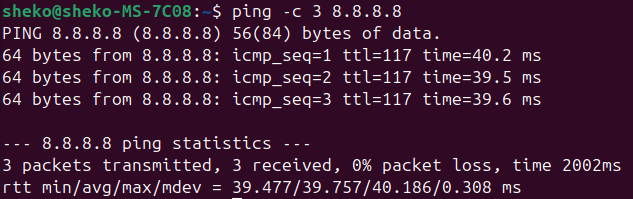
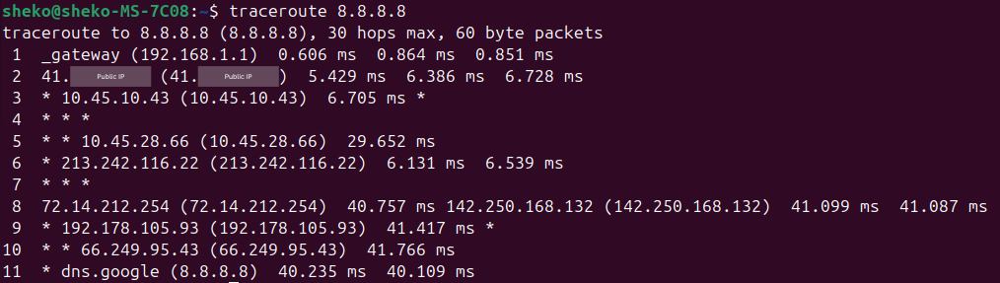
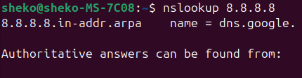

# Online Activity (Task-Based):
1. Use `cat /etc/passwd` and identify the different fields in one of the entries. Extract your own user's info and explain.
Lists all the users on the system with some info about each one such as: `Name`, `ID`, `Username`, `Home Directory`, `Default Shell`.
Example: `sheko:x:1000:1000:Sheko:/home/sheko:/bin/bash`

2. Explain the difference between the `cat` and `more` commands with examples.
`cat`: shows all the file contents, while `more` shows the file contents in the form of pages.

3. Explain the difference between the `rm` and `rmdir` commands.
`rm` removes each specified file. By default, it does not remove directories, while `rmdir` removes the DIRECTORY(ies), if they are empty.

---

4. Create the following directory structure from your home directory:
```
dir1/
  dir11/
    file
  dir12/
mydocs/
  mycv
```
- Try removing `dir11` in one step using `rmdir`. What do you notice? How can you overcome this?
    Output: `rmdir: failed to remove 'dir1/dir11': Directory not empty`
    Solution: `rm -r dir1/dir11`, if `-r` (recursive) option is not used, an error would rise stating that `dir11` is a directory not a file, while `rmdir` would fail since the directory is not empty.

- Remove `dir12` using `rmdir -p`. What happened to the hierarchy? Describe the result.
    Command: `rmdir -p dir1/dir12`
    Conclusion: This command will remove all the directories in the given path (dir1 and dir12) if they are empty. Now, the hirearchy has `mydocs` directory only.

---

5. Copy `/etc/passwd` to your home directory and rename it to `mypassword`.
    ```bash
    cp /etc/passwd mypasswd
    ```

6. Rename `mypassword` to `oldpasswd`.
    ```bash
    mv mypasswd oldpasswd
    ```

---

7. Explain the fields in the `/etc/shadow` file and what each field is used for.
`username:encrypted_password:last_modifi_date:min_age:max_age:warn_period:lock_period`
- `username`: Login name of the user.
- `encrypted_password`: Password encrypted for security.
- `last_modifi_date`: Last modification date (number of days from 1-jan-1970 to the modification date).
- `min_age`: Minimum number of days to wait to change the password again.
- `max_age`: Number of days for the password to expire.
- `warn_period`: Number of days given to the user to change their password before it expires and their account locked as described by next field.
- `lock_period`: Number of days after a password expires before it is locked.

8. List all available Unix shells (from `/etc/shells`).
    ```bash
    cat /etc/shells
    ```

9. From `/usr/bin`, list `4` different ways to go back to your home directory.
- `cd ~`
- `cd /home/$USER`
- `cd ../../home/$USER`
- `cd /home/$(whoami)`

10. Display the first `4` lines of `/etc/passwd`.
    ```bash
    head -n 4 /etc/passwd
    ```

11. Display the last `7` lines of `/etc/passwd`.
    ```bash
    tail -n 7 /etc/passwd
    ```

12. Display the users who are currently logged in.
    ```bash
    who
    ```

13. Display the number of user accounts in the system.
    ```bash
    cat /etc/passwd | wc -l
    ```

---

14. Create a user:
- Username: `islam`
- Comment (Full name): `Islam Askar`
- Password: `islam`
    ```bash
    sudo useradd islam -c "Islam Askar"
    sudo passwd islam
    ```

15. Create another user:
- Username: `baduser`
- Comment: `Bad User`
- Password: `baduser`
    ```bash
    sudo useradd baduser -c "Bad User"
    sudo passwd baduser
    ```

16. Create a supplementary group called `pgroup` with GID `30000`.
    ```bash
    sudo groupadd pgroup -g 30000
    ```

17. Create another supplementary group called `badgroup`.
    ```bash
    sudo groupadd badgroup
    ```

18. Add `islam` to the `pgroup` group as a secondary group.
    ```bash
    sudo usermod islam -aG pgroup
    ```

19. Change `islam`’s password to `password`.
    ```bash
    sudo passwd islam
    ```

20. Set `islam`’s password to expire after `30` days.
    ```bash
    sudo chage -E 30 islam
    ```

21. Lock the `baduser` account.
    ```bash
    sudo passwd -l baduser
    ```

22. Delete the `baduser` account.
    ```bash
    sudo userdel baduser
    ```

23. Delete the `badgroup` supplementary group.
    ```bash
    sudo groupdel badgroup
    ```

---

24. Create a folder `myteam` in your home directory and change its permission to read-only for the owner.
    ```bash
    cd ~
    mkdir myteam
    chmod 400 myteam
    ```

25. Log out and log in as another user and try to `cd` into `myteam`. What happens?
    ```bash
    su islam
    cd myteam
    ```
- Permission denied, since the folder is in the home directory of the first user, there is no read, write or execute permission for the second user to do `ls` or `cd`.

---

27. What are the minimum permissions needed for the following:
- Copy a directory
    - Source Directory → `r-x`
    - Target Directory → `-wx`
- Copy a file
    - Source File      → `r--`
    - Source Directory → `--x`
    - Target Directory → `-wx --- ---`
- Delete a file
    - Source File      → `---`
    - Source Directory → `-wx`
- Change to a directory
    - Source Directory → `--x`
- List contents of a directory
    - Source Directory → `r--`
- View file content
    - Source File      → `r--`
    - Source Directory → `--x`
- Modify a file
    - Source File      → `-w-`
    - Source Directory → `--x`

28. Create a file with permission `444` and:
    ```bash
    touch file
    chmod 444 file
    ```
- Try to edit it. What happens?
    ```bash
    echo "Hello World!" >> file
    ```
    Output: `bash: file: Permission denied`
- Try to delete it. What happens?
    ```bash
    rm file
    ```
    Output: `rm: remove write-protected regular empty file 'file'? y`

29. What is the difference between the `x` permission for:
- A file: run as a program.
- A directory: can be accessed using `cd` command.

---

30. Configure a static IP address on your Linux system.
- Open your netplan file:
    ```bash
    sudo nano /etc/netplan/50-cloud-init.yaml
    ```
- Change your configuration from DHCP:
    ```yaml
    network:
      version: 2
      ethernets:
        eno1:
          dhcp4: true
    ```
- To static IP address:
    ```yaml
    network:
      version: 2
      ethernets:
        eno1:
          dhcp4: false
          addresses:
            - 192.168.1.100/24
          gateway4: 192.168.1.1
          nameservers:
            addresses:
              - 8.8.8.8
              - 8.8.4.4
    ```
- Apply:
    ```bash
    sudo netplan apply
    ```

31. Use the following commands to test and analyze network connectivity to 8.8.8.8:
- `ping`

<p align="center">
  
</p>

- `traceroute`

<p align="center">
  
</p>

- `nslookup`

<p align="center">
  
</p>

32. Explain what a firewall is, how to enable it on Linux, and how to allow a specific port through it.
- A security system that controls incoming and outgoing network traffic based on some rules.
- To enable firewall on Ubuntu:
```bash
sudo ufw enable
sudo ufw status
```
- To allow a specific port such as `8080`:
```bash
sudo ufw allow 8080/tcp
sudo ufw status
```

---

33. Run the `sleep 50` command in the background using `&`. Then, run it normally, send it to the background after starting, find its process ID without using `ps`, and force kill it.
```bash
sleep 50 &
```

```bash
sleep 50
^Z
bg %1
kill -9 %1   # or kill -9 $(pgrep sleep)
```

---
