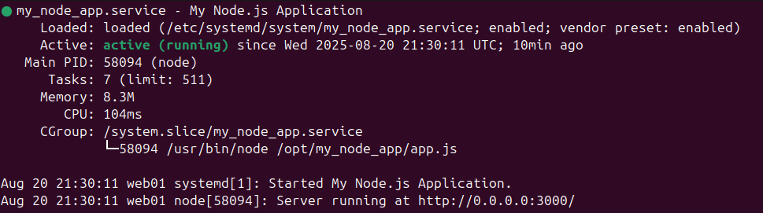
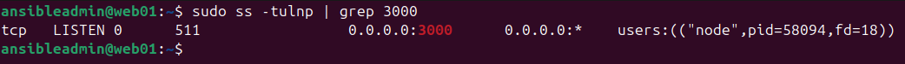
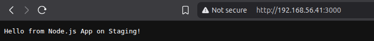

## Prerequisites
1. Vagrant
2. libvirt

---

## How to Run
1. For Ansible's SSH connection, you will need a private key on the Ansible main machine and a public key on the targeted servers.
    - Run `ssh-keygen`, add the key path `/home/$USER/.ssh/ansible_course`, and hit enter for the rest to continue with default.
    - Move the keys to the `Secrets` directory.

2. In the *Vagrant* directory, run:
```bash
vagrant up
```

3. In the *ansible-staging-app* directory, run:
```bash
ansible-playbook -i inventory.ini app_deploy.yml
```

4. From your browser, access:
```
http://192.168.56.41:3000/
```

---

## Deliverables
Submit a document (e.g., PDF or Markdown file) containing:
1. Your [inventory.ini](ansible-staging-app/inventory.ini) file.
2. Your [app_deploy.yml](ansible-staging-app/app_deploy.yml) playbook file.
3. Your [files/app.js](ansible-staging-app/roles/webserver/files/app.js) (and [package.json](ansible-staging-app/roles/webserver/files/package.json)) or equivalent application files.
4. (Optional but Recommended) Your [templates/my_node_app.service.j2](ansible-staging-app/roles/webserver/templates/my_node_app.service.j2) file if you used systemd.
5. Screenshots of:

<p align="center">
  <strong>Successful ansible-playbook execution output</strong>
  <br>
  
</p>

<p align="center">
  <strong>`sudo systemctl status my_node_app` (or your app's service name) from the staging VM</strong>
  <br>
  
</p>

<p align="center">
  <strong>`sudo ss -tulnp | grep [app_port]` from the staging VM</strong>
  <br>
  
</p>

<p align="center">
  <strong>Your web browser showing the successful access to your deployed application on the staging VM's external IP and port</strong>
  <br>
  
</p>

6. Brief Explanation: In your own words, describe what your Ansible playbook does step-by-step and how you verified each part of the deployment.
- First, `app_deploy.yml` calls a role called `requirements` to update apt pacakages and install required packages such as `nodejs` and `ufw`.
- Second, `webserver` role:
    - Create the app directory which will include the source code, which is a variable declared in `webserver/defaults/main.yml`.
    - Copy the source code from `webserver/files/` to the remote server.
    - Run `npm install`.
    - Create a systemd service file using the jinja2 template `webserver/templates/my_node_app.service.j2` to run the app as a service and enable it to run as a startup application.
    - Allow ssh and app ports using a loop on a list variable declared in `webserver/defaults/main.yml`.

---