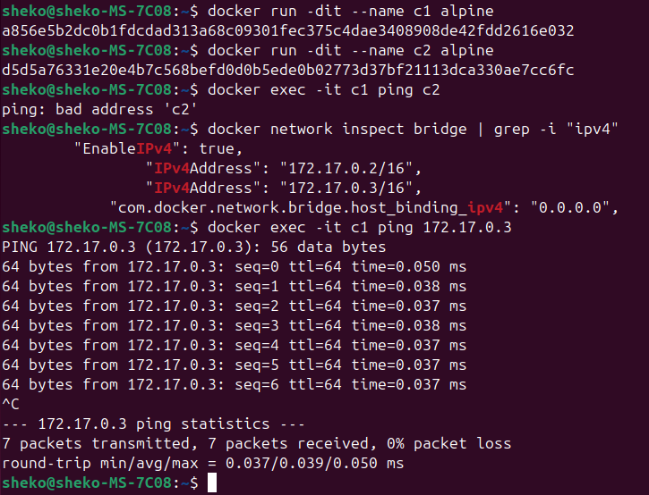
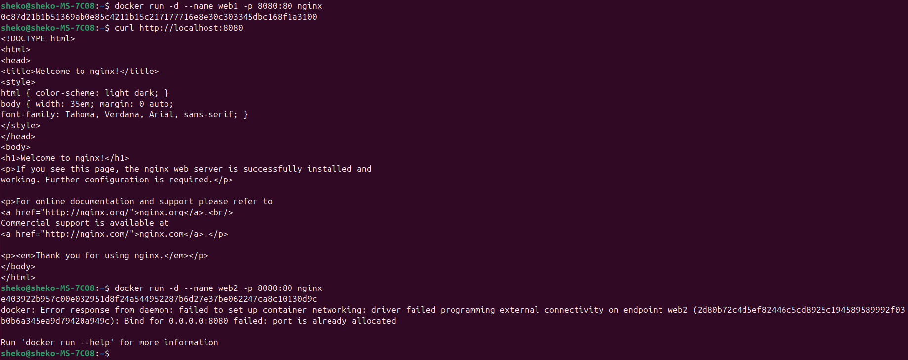
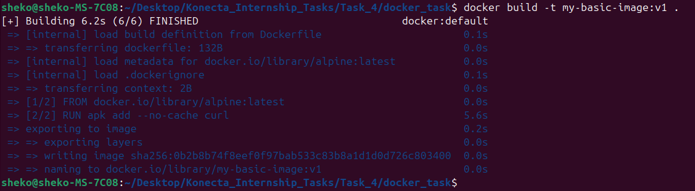
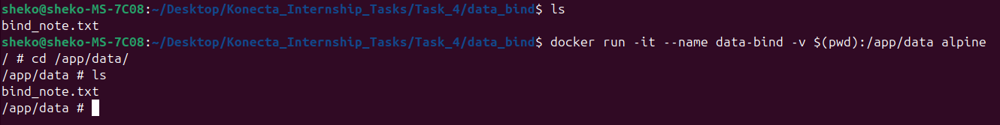
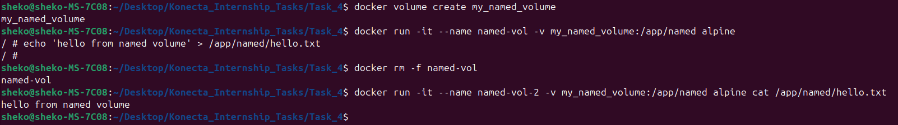
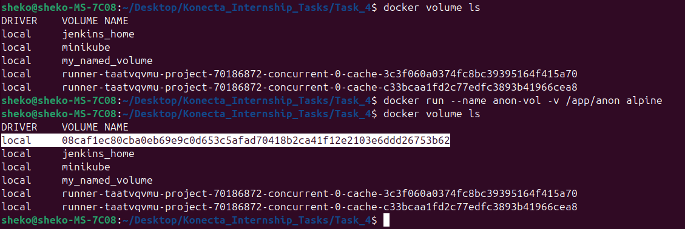
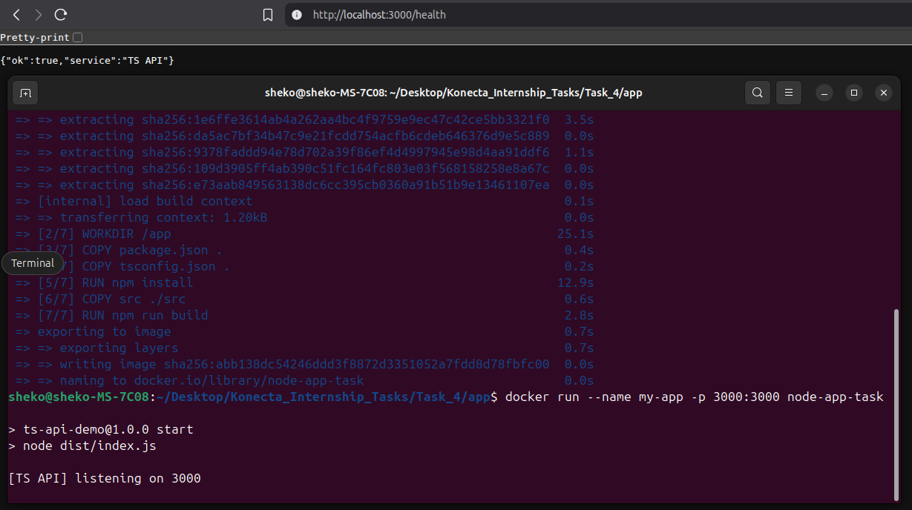

# 🧑‍🎓 Task: Docker Images & Networking 


## 🧪 Part 1: Working with Docker Images

1. **Pull the Alpine and Nginx images:**
```bash
docker pull alpine:latest
docker pull nginx:latest
```
## ❓ Additional Questions – Docker Images (No Dockerfile / Build)

1. **What is the difference between an image and a container?**
   ➤ *Explain in terms of mutability, state, and lifecycle.*

| Aspect          | **Image**                                                        | **Container**                                                                           |
| --------------- | ---------------------------------------------------------------- | --------------------------------------------------------------------------------------- |
| **Mutability**  | Immutable (Cannot be changed once built)                         | Mutable                                                                                 |
| **State**       | Stateless (no runtime data, only packaged code + dependencies).  | Stateful (can have processes, logs, temp files, in-memory data).                        |
| **Lifecycle**   | Built → stored → pulled → used as a template.                   | Created → started → running → paused/stopped → removed                                |

2. **What happens if you run `docker run nginx` twice without removing the first container? Why?**
    ```
    Two different instances (containers) will be created with unique ID and unique random name. There is no conflict, since there is no same port mapping.
    ```

3. **Can two containers be created from the same image at the same time? What happens to their file systems?**
    ```
    Yes, their file systems are isolated unless volume mapping is done.
    ```

4. **What’s the difference between `docker image ls` and `docker ps`? When would you use each?**
    - `docker image ls`: list available images on your machine. Can be used to know the version (tag) of an image.
    - `docker ps`: show **running** containers. Can be used to know if my container is still running (didn't exit).

5. **What’s the purpose of tagging an image (e.g., `myapp:1.0`)? What happens if you don’t specify a tag?**
    ```
    Like a version control for an image. It will be tagged "latest" by default.
    ```

6. **How does Docker know which image to use when you run `docker run ubuntu`?**
    ```
    Searches locally for an image called "ubuntu:latest", if it doesn't exist, it will search on Dockerhub.
    ```

7. **If you delete a container, does it delete the image too? Why or why not?**
    ```
    No, because the container doesn't depend on the image after it is created.
    ```

8. **What does this command do?**
   ```bash
   docker pull ubuntu && docker run -it ubuntu
   ```
   - Pulls the official ubuntu image from Dockerhub.
   - Creates a container of it and enters it (opens an interactive shell).

9. **You have a local image `nginx:latest`. What happens if you run `docker pull nginx` again? Will it download the image again? Why or why not?**
    ```
    It will download the new layers if the latest image on Dockerhub is updated (has new layers other than the local image).
    ```

10. **What’s the difference between these two commands:**
    ```bash
    docker rmi nginx
    docker image prune
    ```
    ➤ *When would each be useful?*
    - `docker rmi nginx`: removes a specific image (nginx). Used when you want to delete an image you no longer use or have a newer version.
    - `docker image prune`: removes unused images (images not referenced by a container). Used to free up space from old unused images.

11. **True or False:** Docker images can be shared between different operating systems.
    ➤ *Explain your answer.*
    ```
    True, a linux-based image requires a linux kernel, and a windows one requires the windows kernel, but Docker Desktop can make a linux-based image run on windows since it creates a lightweight VM underneath.
    ```

12. **Can you save a Docker image as a file and share it without pushing it to Docker Hub? How?**
    ```
    Yes, use `docker save` to save the image to a tar file, and `docker load` to load the image from the tar file.
    ```

13. **What is the result of this command? Why might you use it?**
    ```bash
    docker save -o backup.tar nginx
    ```
    - Exporting an image into a tar file.
    - To be used in backup or shared without the use of Dockerhub.
    
14. **How can you copy an image from one machine to another without using Docker Hub or a registry?**
    ```
    Using `docker save` on the first machine, then sending the tar file to the second machine, and `docker load` on the second machine.
    ```

15. **How do you inspect the internal metadata of an image? What kind of information can you find?**
    ```
    Using `docker inspect image_name`. Some info like ID, size, layers, and configuration (working dir, cmd, ...).
    ```

---

## 🌐 Part 2: Networking and Bridge Mode

4. **Run two containers without specifying a network:**

5. **Try to ping `container1` from `container2`:**
   - What happens? Why?

6. **Inspect the `docker0` bridge network and check container IPs:**

7. **Now try pinging `container1` from `container2` using IP address.**

<p align="center">
  
</p>

---

## 🌍 Part 3: Port Forwarding

8. **Run an Nginx container with port forwarding:**

9. **Access the container from the browser or using `curl`:**

10. **Try running a second Nginx container with the same port mapping. What happens? Why?**
    - Port 8080 on host is in-use (mapped to the first container), where each port can only be used by one service.

<p align="center">
  
</p>

#####
#####

# 🧑‍🎓 Task: Docker Volumes

## Part 1 – Basic Dockerfile
1. Create a directory named `docker_task`.
2. Inside it, create a file named [Dockerfile](docker_task/Dockerfile) that:
   - Uses **`alpine`** as the base image.
   - Installs `curl`
   - Runs `echo hello from container` when the container starts.
3. Build the image and tag it as `my-basic-image:v1`.

<p align="center">
  
</p>

---

## Part 2 – Volumes
You must demonstrate **three types of Docker volumes**:

### 1. Bind Mount
- Create a local directory `data_bind` and put a file `bind_note.txt` inside it.
- Run the container so that `/app/data` inside the container is linked to `data_bind` on your local machine.
- Verify that changes in the container are reflected locally.

<p align="center">
  
</p>

### 2. Named Volume
- Create a named volume called `my_named_volume`.
- Run the container using this named volume mounted at `/app/named`.
- Create a file inside `/app/named` from inside the container and check it persists after container deletion.

<p align="center">
  
</p>

### 3. Anonymous Volume
- Run the container with an anonymous volume mounted at `/app/anon`.
- Verify the anonymous volume is created by listing all volumes after the container starts.

<p align="center">
  
</p>

----
# 🧑‍🎓 Task: Dockerfile
# containerized the following App

## Starter app (provided)

### `package.json`
```json
{
  "name": "ts-api-demo",
  "version": "1.0.0",
  "type": "module",
  "main": "dist/index.js",
  "scripts": {
    "dev": "tsx watch src/index.ts",
    "build": "tsc -p tsconfig.json",
    "start": "node dist/index.js"
  },
  "dependencies": {
    "express": "^4.19.2"
  },
  "devDependencies": {
    "@types/express": "^4.17.21",
    "tsx": "^4.15.7",
    "typescript": "^5.5.4"
  }
}
```

### `tsconfig.json`
```json
{
  "compilerOptions": {
    "target": "ES2022",
    "module": "ES2022",
    "moduleResolution": "bundler",
    "outDir": "dist",
    "rootDir": "src",
    "esModuleInterop": true,
    "strict": true
  },
  "include": ["src"]
}
```

### `src/index.ts`
```ts
import express from "express";
const app = express();
const PORT = Number(process.env.PORT || 3000);
const APP_NAME = process.env.APP_NAME || "TS API";

app.get("/health", (_req, res) => {
  res.json({ ok: true, service: APP_NAME });
});

app.get("/whoami", (_req, res) => {
  res.json({ uid: process.getuid?.(), gid: process.getgid?.() });
});

app.listen(PORT, "0.0.0.0", () => {
  console.log(`[${APP_NAME}] listening on ${PORT}`);
});
```
## Part A — Single-stage image (intentionally sloppy)

Create **`Dockerfile.single`** that:

- uses `node:20`
- installs dependencies
- builds the app
- starts with `npm run start`
- **must work** at `http://localhost:3000/health`

> This is the “baseline” (large image). It just needs to run.

<p align="center">
  
</p>

---
