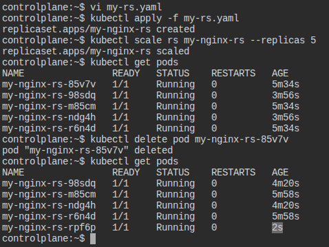
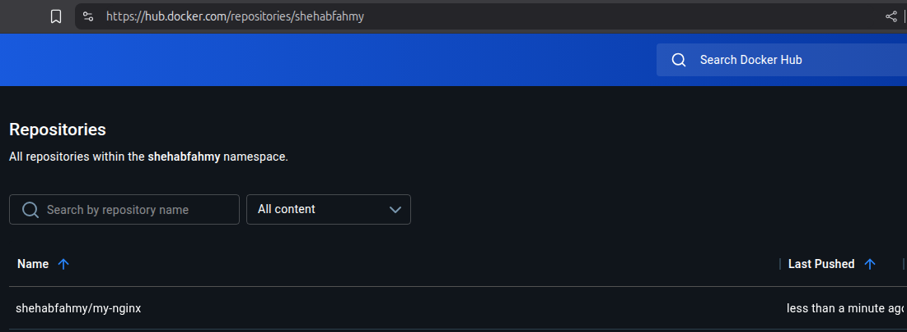
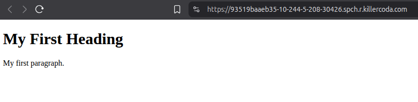
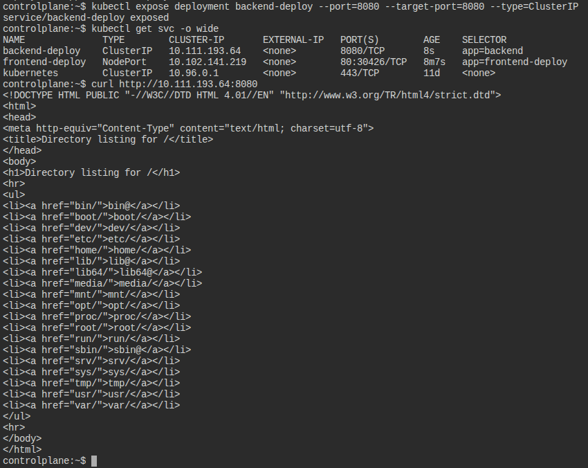
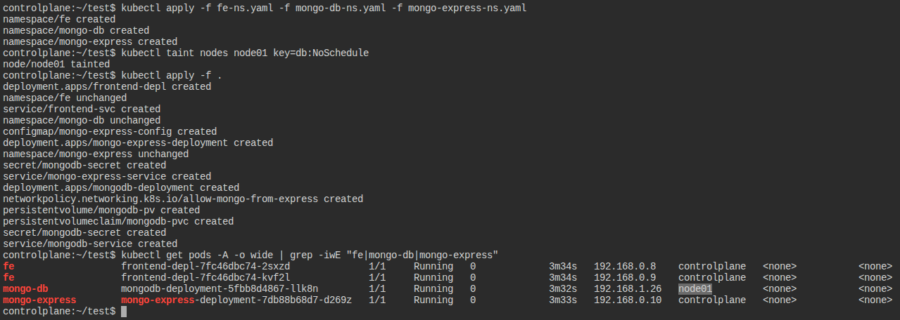
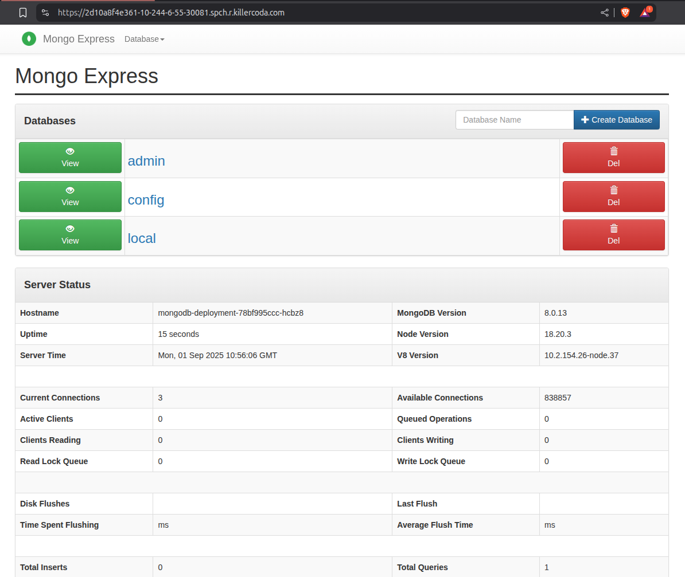

# Kubernetes Task

## Basics Part

### Part 1

1. Create pod nginx with name `my-nginx` direct from command don't use yaml file: 
    ```bash
    kubectl run my-nginx --image nginx
    ```

2. Create pod nginx with name `my-nginx` command and use Image `nginx123`  direct from command don't use yaml file:
    ```bash
    kubectl run my-nginx --image nginx123
    ```

3. Check the status and why it doesn't work:
    ```bash
    kubectl get pods                # -> ErrImagePull
    kubectl describe pod my-nginx   # -> pull access denied, repository does not exist or may require authorization
    ```

4. I need to know node name - IP - Image Of the POD:
    ```bash
    kubectl describe pod my-nginx
    # kubectl describe pod my-nginx | grep -iwE "name|ip|image:"
    ```

5. Delete the pod:
    ```bash
    kubectl delete pod my-nginx
    ```

6. Create another one with yaml file and use label:
    ```yaml
    apiVersion: v1
    kind: Pod
    metadata:
      name: my-nginx
      labels:
        my: label
    spec:
      containers:
      - name: nginx
        image: nginx
        ports:
        - containerPort: 80
    ```
    then, apply using:
    ```bash
    kubectl apply -f my-nginx.yaml
    ```

7. Create a ReplicaSet with 3 replicas using nginx Image:
There is no kubectl create command for ReplicaSets, so we will create a yaml file (can also create a deployment):
    ```yaml
    apiVersion: apps/v1
    kind: ReplicaSet
    metadata:
      name: my-nginx-rs
    spec:
      replicas: 3
      selector:
        matchLabels:
          my: label
      template:
        metadata:
          labels:
            my: label
        spec:
          containers:
          - name: nginx
            image: nginx
    ```

8. Scale the replicas to 5 without edit in the Yaml file:
    ```bash
    kubectl scale rs my-nginx-rs --replicas 5
    ```
 
9. Delete any one of the 5 pods and check what happen and explain:

<p align="center">
  <strong>Replica Controller self heals and creates a new pod</strong>
  <br>
  
</p>

10. Scale down the pods aging to 2 without scale command use terminal:
    ```bash
    kubectl edit rs my-nginx-rs   # and change replicas: 5 to 2
    ```

---

11. Find out the issue in the below Yaml (don't use AI)
    ```yaml
    apiVersion: apps/v1
    kind: ReplicaSet
    metadata:
      name: replicaset-2
    spec:
      replicas: 2
      selector:
        matchLabels:
          tier: frontend
      template:
        metadata:
          labels:
            tier: nginx
        spec:
          containers:
          - name: nginx
            image: nginx
    ```
    - Selector label `tier: frontend` doesn't match Pod's label `tier: nginx`.

12. Find out the issue in the below Yaml (don't use AI)
    ```yaml
    apiVersion: apps/v1
    kind: deployment
    metadata:
      name: deployment-1
    spec:
      replicas: 2
      selector:
        matchLabels:
          name: busybox-pod
      template:
        metadata:
          labels:
            name: busybox-pod
        spec:
          containers:
          - name: busybox-container
            image: busybox
            command:
            - sh
            - "-c"
            - echo Hello Kubernetes! && sleep 3600
    ```
    - Kind has to be PascalCase (`kind: deployment` > `kind: Deployment`).

13. Find out the issue in the below Yaml (don't use AI)
    ```yaml
    apiVersion: v1
    kind: Deployment
    metadata:
      name: deployment-1
    spec:
      replicas: 2
      selector:
        matchLabels:
          name: busybox-pod
      template:
        metadata:
          labels:
            name: busybox-pod
        spec:
          containers:
          - name: busybox-container
            image: busybox
            command:
            - sh
            - "-c"
            - echo Hello Kubernetes! && sleep 3600
    ```
    - API Version of Deployments is `apps/v1` NOT `v1`.

14. What's the command you use to know what Image name that is running the deployment 
    ```bash
    kubectl get deployment deployment-1 -o wide
    ```

---

15. Create a deployment using the following data:
    - Name: `httpd-frontend`
    - Replicas: `3`
    - Image: `httpd:2.4-alpine`
    ```bash
    kubectl create deployment httpd-frontend --replicas 3 --image httpd:2.4-alpine
    ```

16. Replace the image to `nginx777` with command directly: 
    ```bash
    kubectl set image deployment httpd-frontend httpd=nginx777
    ```

17. Rollback to previous version:
    ```bash
    kubectl rollout undo deployment httpd-frontend
    ```

---

18. Create a Simple Web Application:
    - Use a [Dockerfile](Q18_to_Q23/Dockerfile) to create a simple web application (e.g., an Nginx server serving an HTML page).
    - Build the Docker image and push it to DockerHub your private Account.

<p align="center">
  
</p>

19. Create a Deployment Using This Image:
    - Deploy the Docker image from DockerHub to Kubernetes with a Deployment that has 3 replicas.
    ```bash
    kubectl create deployment frontend-deploy --replicas 3 --image shehabfahmy/my-nginx
    ```

20. Expose the Frontend (FE) Using Service to make it accessible from your browser.
    ```bash
    kubectl expose deployment frontend-deploy --port=80 --target-port=80 --type=NodePort
    service/frontend-deploy exposed
    kubectl get svc -o wide
    NAME              TYPE        CLUSTER-IP       EXTERNAL-IP   PORT(S)        AGE   SELECTOR
    frontend-deploy   NodePort    10.102.141.219   <none>        80:30426/TCP   17s   app=frontend-deploy
    ```

<p align="center">
  
</p>

21. Create a [Backend (BE) Deployment](Q18_to_Q23/Q21_deploy.yaml):
    - Create another Deployment for the backend using the following data:
        - Image: `python:3.8-slim`
        - Command: ["python", "-m", "http.server", "8080"] (include this command in the deployment file).

22. Expose the Backend Internally Using Service:
    - Use kubectl command to make it accessible from your browser (without NodePort)
    ```bash
    kubectl expose deployment backend-deploy --port=8080 --target-port=8080 --type=ClusterIP
    ```

<p align="center">
  
</p>

23. Create a LoadBalancer Service:
    - Create a LoadBalancer service for your frontend.
        ```bash
        kubectl expose deployment frontend-deploy --port=80 --target-port=80 --type=LoadBalancer
        ```
    - Explain what happens when you try to apply it in an environment that does not support load balancers (e.g., Minikube).
        - External IP status will stay `pending`, because it can't provision a real external load balancer since there is no cloud provider.  

---

24. Explain DaemonSet and Provide a YAML File:
    - Explain what a DaemonSet is and how it works.
        - It provisions and ensures only one Pod is running on each node in the cluster.
    - Provide a [YAML file](Q18_to_Q23/Q24_daemonset.yaml) to create a DaemonSet in Kubernetes.

25. List the Components of the **Master node** and what is the purpose of each component:
    - API Server: Entry point to cluster, exposes Kubernetes API, handles requests.
    - etcd: Stores cluster state (key-value store).
    - Scheduler: Assigns Pods to nodes based on rules and resources.
    - Controller Manager: Runs controllers to maintain desired state (replicas, nodes, endpoints).
    - Cloud Controller: Connects Kubernetes with cloud provider services.

26. List the Components of the **Worker node** and what is the purpose of each component:
    - Kubelet: Ensures containers in Pods are running on the node, reports to API server.
    - Kube-Proxy: Manages networking between pods and services.
    - Container Runtime: Runs and manages containers (pull images, start/stop containers).

---
---

## Advanced Parts - Bonus

### Part 2
Search for:
- Namespace: a mechanism for isolating groups of resources within a single cluster.
- Configmap: to store non-confidential data in key-value pairs.
- Secret: contains a small amount of sensitive data such as a password, a token, or a key.
- Network Policy: it allows you to specify rules for traffic flow within your cluster, and also between Pods and the outside world.
- Taint and toleration: Taints allow a node to repel a set of pods and Tolerations allow the scheduler to schedule pods with matching taints.
- Volume: a way for containers in a pod to access and share data via the filesystem.

---

### Part 3
Based on the search that you did:

1. Start your minikube with 2 nodes. 
2. Create 3 Namespaces: 
   - `FE`
   - `mongo-db`
   - `mongo-express`

3. Deployments & Services: 
    a. Simple web frontend application in the `FE` namespace with `2` replicas
        - Use an emptyDir Volume to store the web content and mount it to `/usr/share/nginx/html` in the POD.
        - Create a NodePort Service named `frontend-service` to expose the Nginx application externally on port `80`.

    b. Deploy a MongoDB database in the `mongo-db` namespace.
        - Use a Deployment named `mongodb-deployment` with:
            - Replicas: `1`
            - Image: `mongo:latest`
            - Create a Secret named `mongodb-secret` in the `mongo-db` namespace to store the MongoDB root username (`MONGO_INITDB_ROOT_USERNAME`) and password (`MONGO_INITDB_ROOT_PASSWORD`).
            - Root username: `admin`
            - Root password: `admin123`
            - Use a Persistent Volume and Persistent Volume Claim (PVC) named `mongodb-pvc` to store MongoDB data at `/data/db`.
            - Create a ClusterIP Service named `mongodb-service` to expose the MongoDB database internally within the cluster on port `27017`.

    c. Deploy Mongo Express in the `mongo-express` namespace.
        - Use a Deployment named `mongo-express-deployment` with:
            - Replicas: `1`
            - Image: `mongo-express:latest`
            - Create a ConfigMap named `mongo-express-config` in the `mongo-express` namespace to store environment variables for the Mongo Express application.
        - Hint (you should acces the MongoDB by mongo-express deployment)
        - Create a NodePort Service named `mongo-express-service` to expose the Mongo Express interface externally on port `8081`.
    
    d. Apply network policy in the namespace `mongo-db` to be accessible from only `mongo-express` namespace.

4. Use Taints and Tolerations:
    a. Taint one of the Minikube nodes with `key=db:NoSchedule`.
    b. Apply a Toleration in the `mongodb-deployment` to allow the MongoDB pod to be scheduled on the tainted node. 

<p align="center">
  <strong>MongoDB pod is only scheduled on the tainted node</strong>
  <br>
  
</p>

<p align="center">
  <strong>Final result after entering admin password</strong>
  <br>
  
</p>

---
