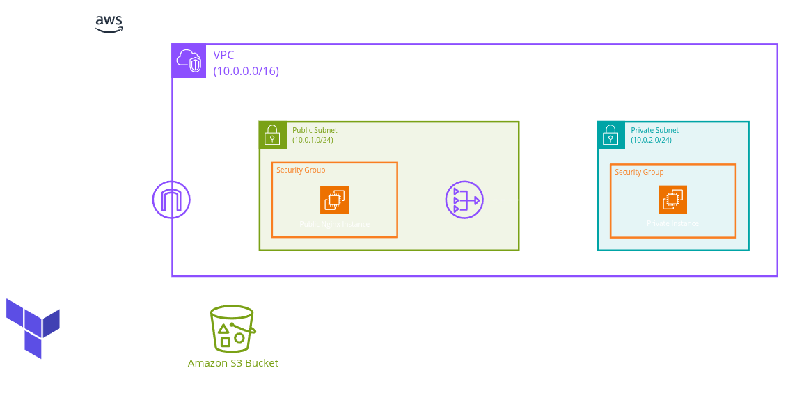
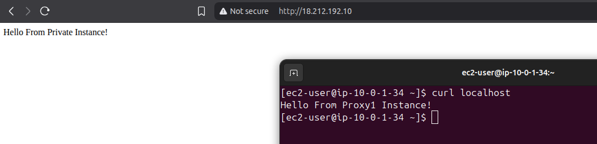
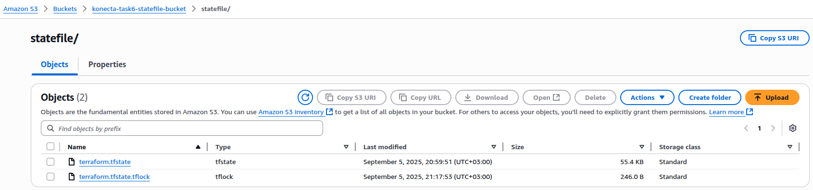

# Terraform Task

  

1. Create the above architecture using Terraform and ensure all variables are managed using a [.tfvars file](Terraform/terraform.tfvars).

2. Research Terraform modules and explore how they can be used for better reusability and maintainability.
    - Custom Modules defined to build this infrastructure:
        - [aws_linux_ec2_remote_exec](Terraform/Modules/aws_linux_ec2_remote_exec/): EC2 instance with remote-exec provisioner.
        - [internet_gateway](Terraform/Modules/internet_gateway/)
        - [key_pair](Terraform/Modules/key_pair/): Creates a key-pair locally and on AWS at the project path.
        - [private_route_table](Terraform/Modules/private_route_table/): Route table with a route to NAT Gateway.
        - [public_route_table](Terraform/Modules/public_route_table/): Route table with a route to Internet Gateway.
        - [route_table_association](Terraform/Modules/route_table_association/): Link a subnet with a Route table.
        - [security_group](Terraform/Modules/security_group/)
        - [subnet](Terraform/Modules/subnet/)
        - [vpc](Terraform/Modules/vpc/)

3. Using a module, create a *public EC2 instance* and install *Nginx* on it using Terraform.
    - The public EC2 instance will serve as a proxy server and a Bastion host to connect to the private EC2 instance.

  <strong>Accessing the public EC2 instance forwards traffic to the private EC2 instance</strong>
   
  

4. Collaborate with your teammate: Since your teammate will contribute to the public EC2 instance architecture, find the proper way to *share the state file* and implement it.
    - Terraform best practices:
        - Remote state file (using S3) to maintain consistency between team members.
        - State locking (using DynamoDB or add `use_lockfile` attribute in S3 bucket in the newer Terraform versions) to act like a sophomore so no more than one person can alter the state file.
        - Back up the state file (enable versioning in S3) as something may happen to the remote storage or someone may accidentally overwrite the data.
    - An S3 bucket must be created Manually (the resource can NOT be defined in this project's files) before applying this infrastructure, then added in the [providers file](Terraform/0_providers.tf).

  <strong>Remote state file after applying resources and state lock while applying them</strong>
   
  

5. Destroy the architecture using only the Terraform command (terraform destroy) *without
deleting the private EC2 instance*. You are not allowed to edit any Terraform files.
    - Three ways:
        - Hard way: `terraform destroy -target=...` for each resource except the EC2 instance.
        - Easy way: `terraform state rm aws_instance.pv-ec2` to stop terraform provisioning for the EC2 instance then `terraform destroy`.
        - Efficient way: Create another state file for critical resources and move them to it using `terraform state mv aws_instance.pv-ec2 ../infra-critical/terraform.tfstate`.

6. Prevent NAT Gateway deletion – Research and implement a method to *prevent the NAT Gateway from being deleted* even when running terraform destroy.
    - A Lifecycle block with `prevent_destroy` attribute set to `true` is added in the NAT Gateway definition block in [VPC file](Terraform/1_vpc.tf).

---