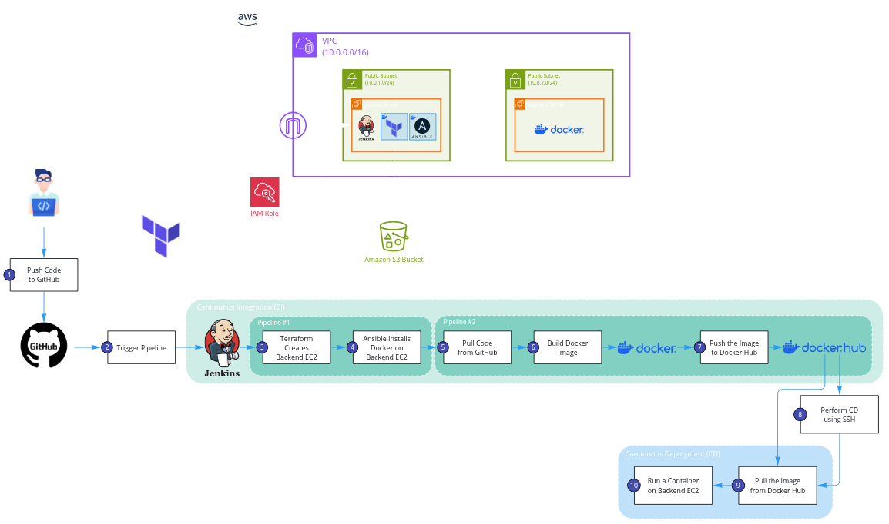
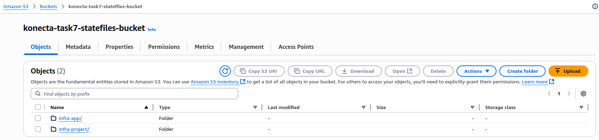
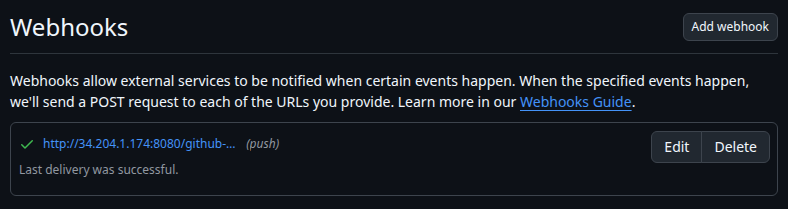
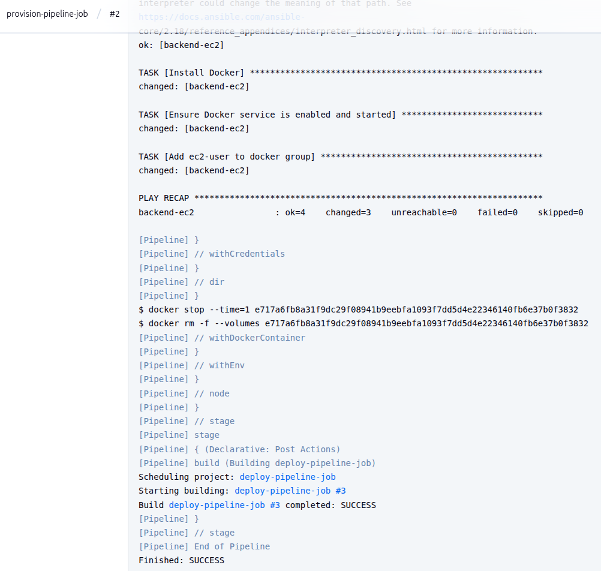
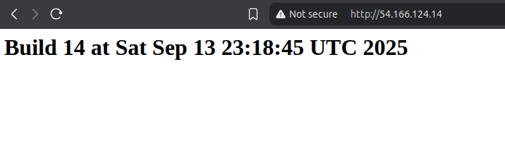
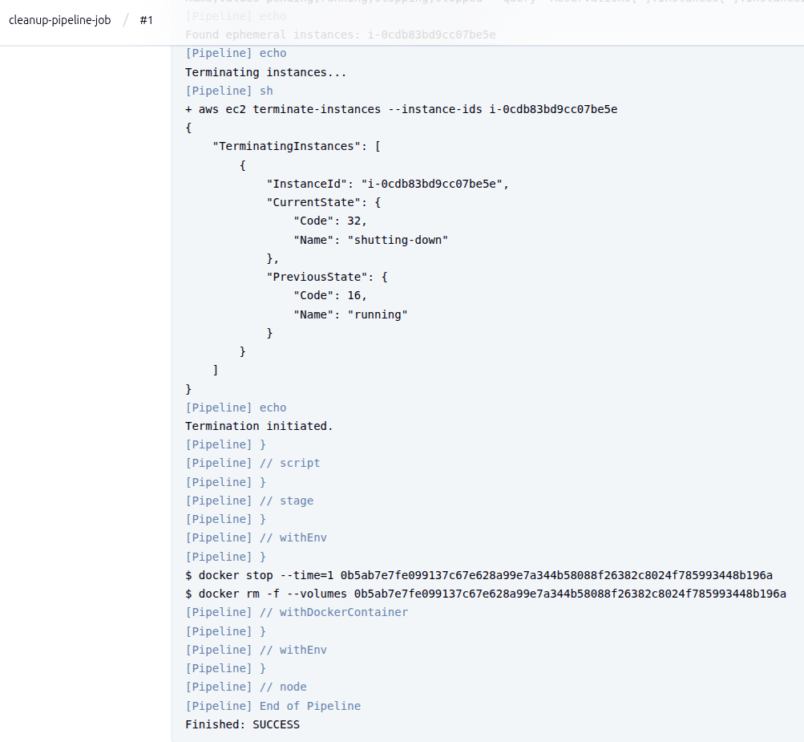

# CI/CD Practical Task — Jenkins + Terraform + Ansible + Docker + Daily Cleanup

## Requirements

### Scenario
- **Pipeline 1 (Provision & Configure):** Webhook-triggered. Creates an ephemeral EC2 with Terraform (remote backend), then configures it with Ansible to install Docker.
- **Pipeline 2 (Build, Push & Deploy):** Auto-triggered after Pipeline 1. Builds an Nginx image, pushes it to private Docker Hub, then SSH-deploys to the EC2 IP.
- **Pipeline 3 (Daily Cleanup):** Scheduled. Terminates all EC2 instances tagged as ephemeral at **12:00 AM Africa/Cairo** every day.

### Repo layout
```
.
├── Jenkinsfile.provision          # Pipeline 1
├── Jenkinsfile.deploy             # Pipeline 2
├── Jenkinsfile.cleanup            # Pipeline 3 (NEW)
├── terraform/
│   ├── main.tf
│   ├── variables.tf
│   ├── outputs.tf                 # outputs public_ip
│   └── backend.tf                 # remote backend (e.g., S3+DynamoDB)
└── ansible/
    └── playbook.yml               # installs Docker, enables service
```

### Pipeline 1 — Provision & Configure (Webhook-triggered)
**Trigger:** Git webhook on push to `main`.
**Required steps:**
1. Terraform init with remote backend (no local state).
2. Terraform apply: create t2.micro/t3.micro instance with tags:
   - Name=ci-ephemeral, lifespan=ephemeral, owner=jenkins
3. Terraform output: expose `public_ip`.
4. Ansible: install & enable Docker on the new host.

### Pipeline 2 — Build, Push & Deploy (Triggered with IP param)
**Trigger:** Automatically after Pipeline 1; receives `EC2_IP` param.
**Required steps:**
1. Build Docker image from `nginx:alpine` with custom `index.html` (show `BUILD_NUMBER` + timestamp).
2. Login to private Docker Hub using Jenkins credentials.
3. Push image tagged `docker.io/<namespace>/nginx-ci:<BUILD_NUMBER>` (or git SHA).
4. Deploy via SSH to `EC2_IP`: replace any existing container `web`, run on port 80, verify with `curl`.

### Pipeline 3 — Daily Cleanup (Scheduled at 12:00 AM Africa/Cairo)
**Goal:** Remove all EC2s bearing the ephemeral tag each midnight.
**Trigger (Jenkins schedule):**
- In the job configuration, set *Build periodically* with:
  ```
  TZ=Africa/Cairo
  0 0 * * *
  ```
  *(This runs at 00:00 Cairo time.)*
**Required steps:**
1. Use Jenkins AWS credentials (least-privilege IAM) in the job.
2. Find instances with the ephemeral tag (match what you set in Pipeline 1). For example:
   - lifespan=ephemeral and/or Name=ci-ephemeral
3. Terminate all matching instances (running or stopped).
4. Log the list of terminated instance IDs.
**Implementation notes (what trainees should do):**
- Use AWS CLI filters like:
  - Name=tag:lifespan,Values=ephemeral
  - State filter for pending,running,stopping,stopped to catch everything.

### Constraints & Rules 
- Remote Terraform backend must be used.
- All secrets via Jenkins credentials (AWS, SSH key, Docker Hub).
- Idempotency: re-runs don’t duplicate infra; deploy replaces container cleanly.
- Cleanup pipeline must not require manual input and must honor the Cairo timezone schedule.

### Acceptance Criteria
- **P1:** Webhook push to `main` triggers provisioning; EC2 has required tags; Docker installed.
- **P2:** Receives `EC2_IP`; builds, logs in, pushes to private Docker Hub; SSH-deploy succeeds; `curl` shows custom page with build identifier.
- **P3:** Runs daily at 00:00 Africa/Cairo; logs show discovery and termination of all instances with `lifespan=ephemeral` (or “none found”).
- **Security:** No secrets in git; Jenkins credentials used; least-privilege IAM for cleanup.

### (Optional) Acceptable Alternatives for IP Handoff

Trainees may choose one instead of parameter passing:
1. AWS SSM Parameter Store (Pipeline 1 writes, Pipeline 2 reads).
2. EC2 Tag Discovery (Pipeline 1 tags with a unique marker; Pipeline 2 queries by tag).

---
---

## Overview

<p align="center">
  
</p>

## How to Run

```
1)                                                      `cd Infra_Project/`
                                                                 |
2)                                               `cd Terraform/ && terraform apply`
                                                                 |
3)                                       `cd ../Ansible/ && ansible-playbook playbook.yaml`
                                                                 |
4)                 Access Jenkins Server and add new credentials "Username with password" with ID "dockerhub-creds"
                                                                 |
5)                                                   Configure GitHub Webhook
                                                                 |
6)                  Create 3 Pipelines "provision-pipeline-job", "deploy-pipeline-job", and "cleanup-pipeline-job"
                                                                 |
                                                           Run Pipeline
```

### Infra_Project: Jenkins EC2 Server
#### Terraform
- Has two separate state files with consistent resources:
    - Infra_Project: Networking, Jenkins EC2, and IAM Role with least-privilege policy
    - Infra_App: Backend EC2

<p align="center">
  
</p>

#### Ansible
- Installs Jenkins and its required tools.
- Installs Jenkins Plugins
- Creates an admin user for Jenkins.
- Creates an SSH key credential for Ansible/SSH.

---

### Configure GitHub Webhook
1. Go to the repository **Settings** > **Webhooks** > **Add Webhook**:
    - Payload URL: `https://<jenkins-ec2-ip>/github-webhook/`
    - Content type: `application/json`
    - Leave the rest as default.
2. Add webhook.
3. Refresh the page. You should see that it is working:

<p align="center">
  
</p>

---

### Pipeline 1 — Provision & Configure
1. **Create a new pipeline job:**
   * Go to **Jenkins → New Item → Pipeline**, name it `provision-pipeline-job`.
   * Choose **Pipeline** and click **OK**.
2. **Connect to GitHub repo:**
   * Under **Pipeline → Definition**, select **Pipeline script from SCM**.
   * SCM: **Git**
   * Repository URL: `<your-repo-url>`
   * Credentials: add your GitHub credentials if private repo.
   * Branch: `main`
   * Script Path: `Jenkinsfile.provision`
3. **Configure trigger:**
   * Under **Build Triggers**, select **GitHub hook trigger for GITScm polling**.
   * Ensure your GitHub webhook is pointing to Jenkins for `main` branch pushes.
4. **Credentials:**
   * Ansible can use SSH key stored in Jenkins **Credentials → SSH Key** (automated creation using Infra_Project Ansible role).

<p align="center">
  
</p>

---

### Pipeline 2 — Build, Push & Deploy
1. **Create a new pipeline job:**
   * **Jenkins → New Item → Pipeline**, name it `deploy-pipeline-job`.
2. **Connect to GitHub repo:**
   * **Pipeline script from SCM** → Git → `<repo>` → Branch: `main`
   * Script Path: `Jenkinsfile.deploy`
3. **Configure parameter for EC2 IP:**
   * In **General → This project is parameterized**, add a **String Parameter** called `EC2_IP`.
4. **Configure triggering from Pipeline 1:**
   * Write **Jenkinsfile.provision** to call `build job: 'deploy-pipeline-job', parameters: [string(name: 'EC2_IP', value: "${EC2_IP}")]`.
5. **Credentials:**
   * Docker Hub login stored as **Jenkins credentials → Username/Password** (manual creation).
   * SSH key for EC2 deployment also stored in Jenkins credentials (previously created automatically).

<p align="center">
  
</p>

---

### Pipeline 3 — Daily Cleanup
1. **Create a new pipeline job:**
   * **Jenkins → New Item → Pipeline**, name it `cleanup-pipeline-job`.
2. **Connect to GitHub repo:**
   * **Pipeline script from SCM → Git → `<repo>` → Branch: `main`**
   * Script Path: `Jenkinsfile.cleanup`
3. **Set schedule:**
   * Under **Build Triggers → Build periodically**, set:
     ```
     TZ=Africa/Cairo
     0 0 * * *
     ```
4. **Credentials:**
   * No AWS credentials needed, since Jenkins EC2 has IAM role.

<p align="center">
  
</p>

---
