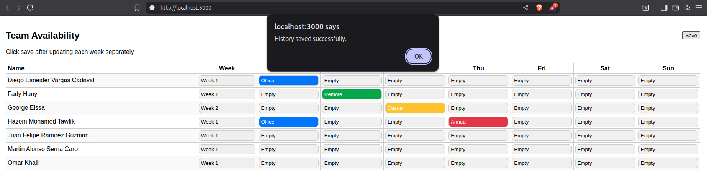
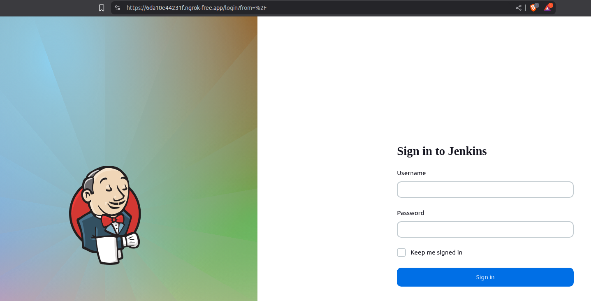
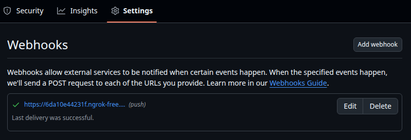
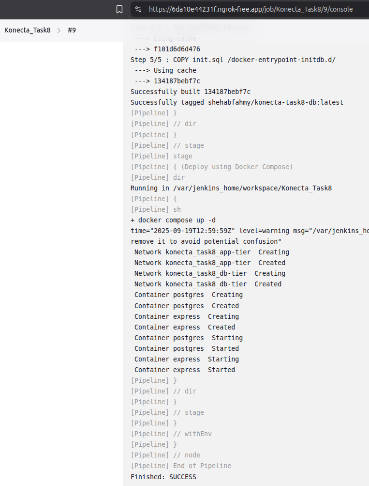
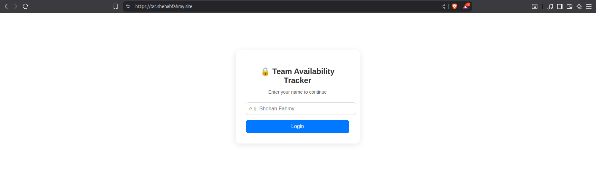
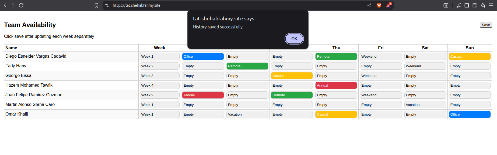

# Intern Project: Building a CI/CD Pipeline for the Availability Tracker

## Overview

You will be working on a real application used to track team availability. This app is currently hosted on GCP and has been used internally for monitoring. Your task is to build a CI/CD pipeline to automate the lifecycle of the application from code quality checks to building and running it locally.

This project will simulate real-world DevOps tasks and workflows, giving you experience with common tools like Git, Docker, and Bash scripting.

---

## Project Structure

```
.
├── .gitignore                  # Ignore node_modules, logs, and other unnecessary files
├── ci.sh                       # Bash script to install dependencies, lint, test, build, and deploy
├── docker-compose.yml          # Orchestrates Node.js app and PostgreSQL service
│
├── App/                        # Node.js application
│   ├── Dockerfile              # Efficient Dockerfile for building the app container
│   ├── eslint.config.mjs       # ESLint configuration
│   ├── package.json            # Dependencies, scripts for linting/testing/building
│   ├── public/                 # Public assets
│   │   └── script.js           # Frontend JS, modified to use PostgreSQL client
│   ├── server.js               # Backend server, connects to PostgreSQL
│   └── tests/                  # Unit tests
│       └── server.test.js      # Tests for server functionality
│
└── PostgreSQL/                 # PostgreSQL service
    ├── Dockerfile              # Dockerfile for PostgreSQL with pre-loaded schema
    └── init.sql                # SQL schema initialization
```

### Functionalities

- **ci.sh** – Automates:
  - Installing npm
  - Installing project dependencies
  - Linting code with ESLint
  - Running unit tests and Node.js built-in tests
  - Building Docker images
  - Deploying using Docker Compose
- **Dockerfile** – Efficient Dockerfile:
  - Multi-stage build to reduce image size:
      - * **Build stage**: Installs production dependencies and copies code to minimize layer rebuilds
      - * **Runtime stage**: Slim image only containing necessary runtime files
  - Dependencies installed first to cache layers
  - Only production dependencies installed in runtime image
- **PostgreSQL/Dockerfile** – Builds PostgreSQL image with pre-loaded schema (`init.sql`).
- **PostgreSQL/init.sql** – Creates database schema for PostgreSQL.
- **docker-compose.yml** – Connects app with PostgreSQL instead of using `output/history.json`.
- **App/eslint.config.mjs** – Configures linting rules.
- **App/package.json** – Includes scripts for testing, linting, and running the app; updated for PostgreSQL integration.
- **App/server.js** – Connects to PostgreSQL database and serves app endpoints.
- **App/public/script.js** – Updated to fetch/post data from PostgreSQL instead of JSON file.
- **App/tests/server.test.js** – Unit tests validating server routes and database interactions.

---

## Local Deployment

### Using `ci.sh`

1. Clone the repository

2. Make the script executable and run it:
   ```bash
   chmod +x ci.sh
   ./ci.sh
   ```
The script will:
* Install npm and project dependencies
* Lint the code
* Run tests
* Build Docker images
* Deploy the app using Docker Compose

3. Access the app at:
    ```
    http://localhost:3000
    ```

<p align="center">
  
</p>

---

### Using Jenkins

In this repository, Jenkins was used as a Docker container rather than being installed on the host machine. Therefore, Docker volume mapping was used to access `docker`, `docker compose`, `npm`, and `node`, which were already installed on the host machine. Docker port mapping for port `3000` was not needed, since host machine's Docker was used.
```sh
docker network create jenkins-network
docker run -d \
  --name jenkins-for-konecta-task8 \
  --network jenkins-network \
  -p 8080:8080 \
  -p 50000:50000 \
  -v /var/jenkins_home:/var/jenkins_home \
  -v /usr/bin/docker:/usr/bin/docker \
  -v /usr/libexec/docker/cli-plugins/docker-compose:/usr/libexec/docker/cli-plugins/docker-compose \
  -v /var/run/docker.sock:/var/run/docker.sock \
  -u root \
  jenkins/jenkins:lts
```

#### Build Trigger using GitHub Webhook
##### Jenkins Configuration
1. First, push your [Jenkinsfile](Jenkinsfile) to the repository that will trigger the build.
2. In your pipeline, go to **Configure** > **Build Triggers**, and check **GitHub hook trigger for GITScm polling**.
3. In the pipeline section, choose:
    - Definition: `Pipeline script from SCM`
    - SCM: `Git`
    - Repository URL: `<Repo_URL>`
    - Credentials: The GitHub token used in the pipeline to clone the application.
    - Branch Specifier: `*/main`
    - Script Path: `Jenkinsfile`
4. Save the configuration.

##### Ngrok Configuration
Since Jenkins was used locally, GitHub wouldn't be able to access it. Therefore, a tunneling service such as Ngrok was used to expose `localhost:8080`.
1. Instead of installing the entire tool, an Ngrok container was used and added to the same Docker network as the Jenkins container:
```sh
docker run --rm -it \
--name ngrok-container-for-jenkins \
--network jenkins-network \
-e NGROK_AUTHTOKEN=$(cat ./Secrets/ngrok_authtoken) \
ngrok/ngrok \
http jenkins-for-konecta-task8:8080
```
- ***Note:*** Make sure to run the previous command in the project directory.
2. A new window will open in your terminal after executing the previous command, use the URL in the `forwarding` row to access the Jenkins server:

<p align="center">
  
</p>

##### GitHub Webhook Configuration
1. Go to the repository **Settings** > **Webhooks** > **Add Webhook**:
    - Payload URL: `https://<your-ngrok-url>/github-webhook/`
    - Content type: `application/json`
    - Leave the rest as default.
2. Add webhook.
3. Refresh the page. You should see that it is working:

<p align="center">
  
</p>

#### Final Output

<p align="center">
  <strong>Pipeline output after getting triggered by a GitHub Push</strong>
  <br>
  
</p>

---

## Cloud Deployment using AWS and Terraform

### Goal
Host our application on **AWS** with the **minimum cost possible**.

### Proposed Architecture
Our code is split into three main parts:
- **Frontend (static files)** → Hosted on **GitHub Pages**
  - Files: `input/*` and `public/*`
- **Backend (dynamic logic)** → Replaced by **AWS Lambda functions**, triggered via **AWS API Gateway**
  - File replaced: `server.js`
- **Database** → The PostgreSQL database (used in local deployments) is replaced with the original `history.json` file, stored in an **S3 bucket**

### Important Notes
- Why GitHub Pages?
    - **Cost:** ***Free***
    - **Benefits:**
      - Enables version control for source code
      - Eliminates the need for an extra S3 bucket with static website hosting

- Why AWS Lambda?
    - **Requests:**
      - First **1 million requests/month** → **Free** (always free tier)
      - Then **$0.20** per 1M requests
      - **Our usage:** ~70 requests/day (≈ **2,100/month**) → ***well below free tier***

    - **Compute Time:**
      - First **400,000 GB-seconds/month** → **Free** (always free tier)
      - Then **$0.0000166667** per GB-second
      - **Our usage:**
        - Each Lambda: ~100ms runtime, 128MB memory
        - GB-seconds per request = `0.125 × 0.1` = 0.0125
        - Total = `2,100 × 0.0125` = **26.25 GB-seconds/month** → ***well below free tier***
    
- Why AWS S3?
    - **Storage:**
      - `history.json` ≈ 50 KB → ***$0.000001/month***
      - Storage Class Type → **Standard**, for instant access

    - **Requests:**
      - PUT, COPY, POST, LIST → **$0.005 per 1,000**
      - GET → **$0.0004 per 1,000**
      - **Our usage:**
        - ~1,050 GET → **$0.00042/month**
        - ~1,050 PUT → **$0.00525/month**
        - Total = ***$0.00567/month (~half a cent)***

- Why NOT AWS DynamoDB?:
    - **Problem**: Source code is written in a way to "fetch all and save all" data.
    - **Cost**: First **25 million requests** per month are **free** (always free tier), that would be better than AWS S3 if the source code allows fetching or updating only what you need.
    - If we fetch all items and rewrite them all the time in DynamoDB, we are basically using it like a JSON file in S3 — but paying the DynamoDB overhead without benefiting from its strengths.

- Total Cost Estimation:
    - GitHub Pages = ***$0***
    - AWS Lambda = ***$0*** (free tier)
    - S3 Storage = ***$0.000001***
    - S3 Requests = ***$0.00567***
***Total ≈ $0.01/month (rounding up generously)***
Even with **10x traffic (20,000+ requests)**, the cost would still stay ***under $0.10/month***.

- Added a simple static authentication layer (case-insensitive first name or full name) to prevent unauthorized users from consuming backend API requests.
  *Note: this is a lightweight protection mechanism and not a full security solution against large-scale DDoS attacks.*

### Installation
#### GitHub Pages
1. Move the contents of the `public/` directory to the repository root so that `index.html` is directly in the root.
2. Create a new GitHub repository and push the files:
   ```bash
   git init
   git remote add origin <your-repo-url>
   git add .
   git commit -m "Initial commit"
   git push -u origin main
   ```
3. Go to **Repository Settings** > **Pages**.
   Under **Branch**, select `main` and click **Save**.
4. (Optional) Add a custom domain:
   - Configure DNS records at your domain registrar:
     - `CNAME` → Name: `tat`, Target: `<your-user>.github.io`
     - `A` → Name: `@`, Target: `185.199.110.153` (GitHub Pages IP)

<p align="center">
  <strong>Accessing the Website</strong>
  <br>
  
</p>

#### AWS (with Terraform)
1. Navigate to the [Terraform/](Terraform/) directory and run:
   ```bash
   terraform init
   terraform apply
   ```
2. Copy the Terraform output `api_invoke_url` (remove the trailing `/`) and update the `API_BASE` variable in [script.js](Frontend_Cloud_Deployment/script.js).
3. Push changes to GitHub to deploy the frontend.

<p align="center">
  <strong>Final Cloud Deployment</strong>
  <br>
  
</p>

---
