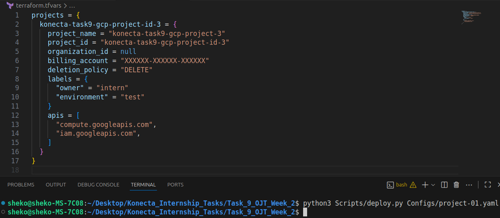
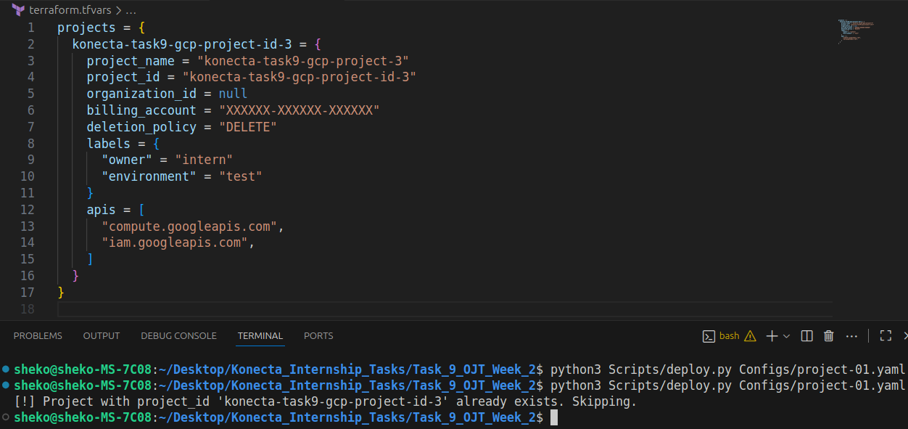
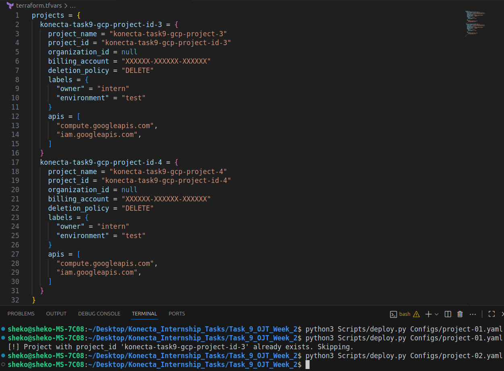
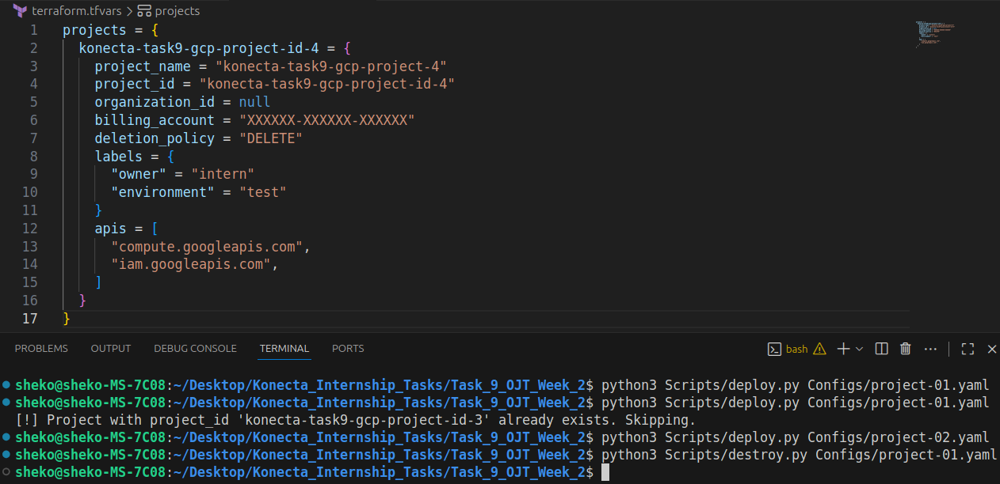
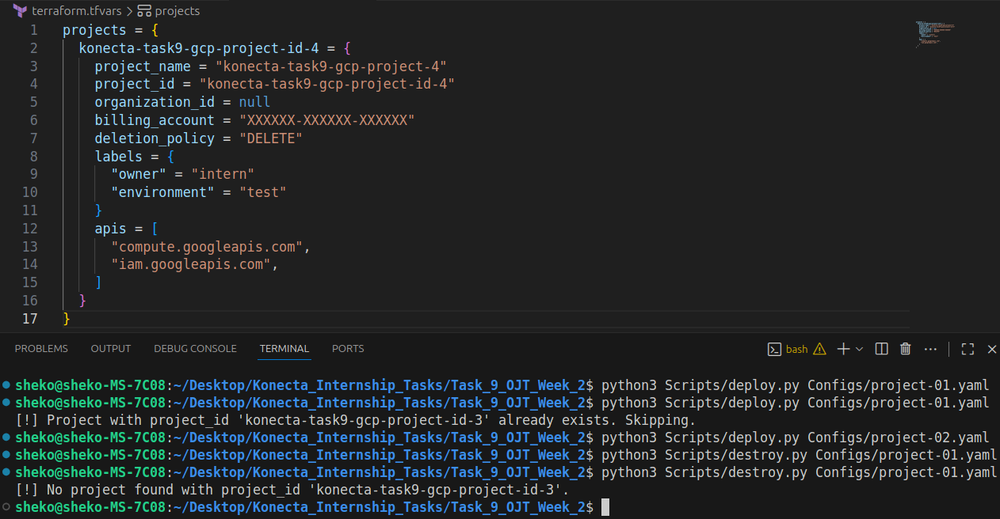
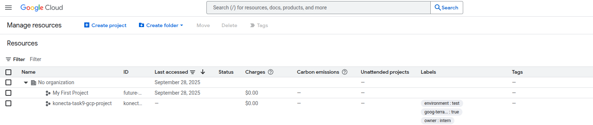

# AutoGCP: Simple GCP Project Creation via YAML

This project provides a **lightweight automation framework** to simplify creating and managing GCP projects.
Instead of writing and editing Terraform code manually, you can now define your project in a **YAML file** and let Python scripts handle the rest.

By the end of setup, you’ll be able to:

- Provision new GCP projects with a single command
- Keep project configurations clean in YAML files
- Reuse the same Terraform module for multiple projects
- Destroy projects easily when no longer needed

---

## Project Goal

The goal is to make **GCP project creation simple and reusable**.

This setup will:

1. Take a YAML config file with project details
2. Convert it into Terraform variables
3. Use Terraform to provision the GCP project
4. Optionally, allow easy cleanup via `destroy.py`

---

## Tools Used

- **Terraform** – Infrastructure as Code
- **GCP (Google Cloud Platform)** – Cloud provider
- **Python** – Automation scripting
- **YAML** – Config format for projects
- **Git** – Version control

---

## Project Structure

```
.
├── main.tf                  # Root Terraform configuration
├── variables.tf             # Root variable definitions
├── terraform.tfvars         # Auto-generated variables file (updated by scripts)
├── modules/
│   └── project/
│       ├── main.tf          # Terraform logic for GCP project creation
│       └── variables.tf     # Module input variables
├── configs/
│   └── example-project.yaml # Sample YAML project config
├── scripts/
│   ├── helper_functions.py  # Shared functions for YAML + Terraform
│   ├── deploy.py            # Deploy new projects
│   └── destroy.py           # Remove existing projects
└── README.md                # Documentation
```

---

## How It Works

```
YAML Config  →  Python Script  →  terraform.tfvars  →  Terraform Apply
                  (deploy.py)       (auto-updated)        (creates GCP Project)

YAML Config  →  Python Script  →  terraform.tfvars  →  Terraform Destroy
                  (destroy.py)      (project removed)     (removes GCP Project)
```

### 1. **Terraform Module (`modules/project/`)**

* Creates a new GCP project
* Links to a **billing account**
* Adds **labels**
* Enables required **APIs** (e.g., Compute, IAM)
* Uses inputs: `project_id`, `organization_id`, `billing_account`, `labels`, `apis`

---

### 2. **Root Config (`main.tf`)**

* Calls the project module
* Reads variables from `terraform.tfvars`

---

### 3. **YAML Config (`configs/example-project.yaml`)**

Example:

```yaml
project_name: "auto-intern-demo"
project_id: "auto-intern-demo-id"
organization_id: "YOUR_ORG_ID"
billing_account: "XXXXXX-XXXXXX-XXXXXX"
deletion_policy: "DELETE"
labels:
  owner: intern
  environment: test
apis:
  - compute.googleapis.com
  - iam.googleapis.com
```

---

### 4. **Python Scripts (`scripts/`)**

#### deploy.py

* Reads a YAML config
* Ensures `terraform.tfvars` contains a `projects = {}` block
* Adds the new project block inside `projects = {}` keyed by `project_id`
* Runs `terraform init` + `terraform apply -auto-approve`

Usage:

```bash
cd scripts
python3 Scripts/deploy.py Configs/example-project.yaml
```

---

#### destroy.py

* Reads the same YAML config
* Finds and removes the project block from `terraform.tfvars` using `project_id`
* Runs `terraform apply -auto-approve`; since the project block is missing, Terraform will destroy the project automatically

Usage:

```bash
cd scripts
python3 Scripts/destroy.py Configs/example-project.yaml
```

---

#### helper_functions.py

Reusable helpers:

* `ReadYaml(sysArgs, callerName)` → Parse YAML into Python dict
* `RunTerraform(parent_dir)` → Run `terraform apply` in project root

---

#### Project Lifecycle in Action

<p align="center">
  <strong>Creating a new project</strong>
  <br>
  
</p>

<p align="center">
  <strong>Attempting to create the same project again (idempotency check)</strong>
  <br>
  
</p>

<p align="center">
  <strong>Creating another project</strong>
  <br>
  
</p>

<p align="center">
  <strong>Removing a project</strong>
  <br>
  
</p>

<p align="center">
  <strong>Removing a non-existing project</strong>
  <br>
  
</p>

<p align="center">
  <strong>Applying the configuration with Terraform</strong>
  <br>
  
</p>

---

## Notes

* Each project block is stored in `terraform.tfvars` under `projects = { ... }`
* Projects are **uniquely identified by `project_id`**
* `terraform.tfvars` is created automatically if missing
* Duplicate projects will not be added
* Removing a project requires the same YAML file used during creation

---

## Extra Credit (Optional Enhancements)

* Add a GitHub Actions workflow to auto-run `deploy.py` when new YAML configs are committed
* Add Slack/email notifications after successful provisioning
* Extend scripts to manage other GCP resources (e.g., IAM bindings, VPCs)

---

